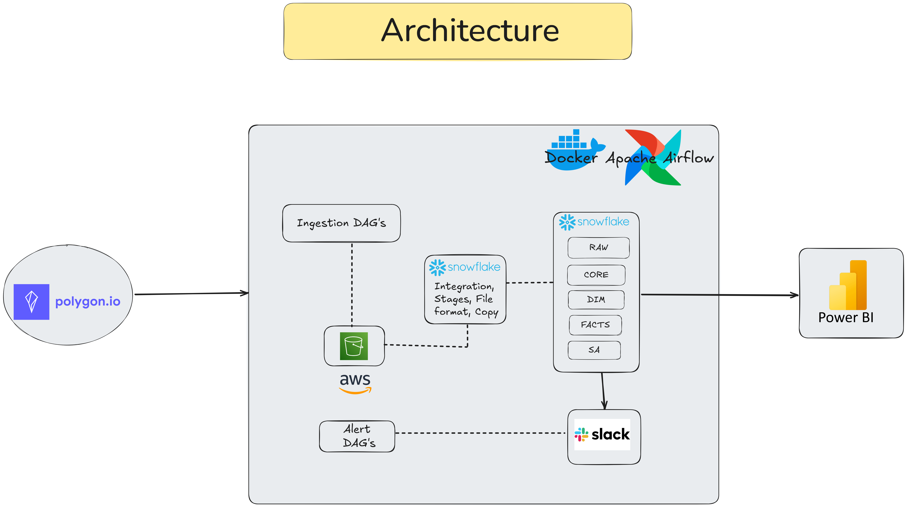

# Automated EOD Securities Pricing Analytics Platform

*(Repository: eod-market-data-engineering-platform)*

---

## Overview

This project implements a fully automated, end-to-end data engineering platform for processing U.S. End-of-Day (EOD) securities pricing and liquidity data.

The platform replaces manual CSV-based reporting workflows with a scalable Snowflake-powered data warehouse and Apache Airflow–orchestrated batch processing, enabling reliable and analytics-ready data delivery before market open.

---

## Core Components

- Historical data backfill ingestion  
- Incremental daily batch processing  
- Multi-layer Snowflake data warehouse  
- Data validation and reject handling framework  
- Apache Airflow workflow orchestration  
- Slack-based failure alert notifications  
- BI-ready Subject Area (SA) publishing  

---

## Architecture

The warehouse follows a structured layered design:

**RAW → CORE → DIM → FACT → SA**

- **RAW** – Immutable ingestion layer from source API  
- **CORE** – Cleansed, standardized, and validated datasets  
- **DIM** – Dimension tables for analytics joins and enrichment  
- **FACT** – Transactional pricing and liquidity data  
- **SA** – Curated, analytics-ready views for BI consumption  

---

## Architecture Diagram

---

## Dashboard Preview

### Market Liquidity Overview

### Sector & ETF Insights

---

## Key Features

- Incremental **MERGE-based loading strategy** in Snowflake  
- Pre-merge and post-merge data validation checks  
- Reject table handling for malformed or inconsistent records  
- Fully automated Airflow DAG scheduling  
- Slack notifications for pipeline monitoring and failure alerts  

---

## Pipeline Capabilities

- Processes EOD pricing for **6,000+ U.S. securities**  
- Automated historical backfill initialization  
- Reliable daily incremental refresh before market open  
- Data quality enforcement across multiple pipeline stages  
- BI-ready curated datasets optimized for analytics consumption  

---

## Tech Stack

- Snowflake  
- Apache Airflow  
- Python  
- SQL  
- AWS S3  
- Slack Integration  
- Power BI  

---

## Business Impact

- Eliminated manual reporting workflows  
- Reduced analyst effort by ~80%  
- Improved visibility into liquidity and sector-level trends  
- Enabled analytics on **$500B+ daily traded value**